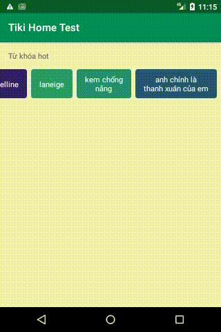

# Home Test

|Requirement|Status|
| --- | --- |
| ✅ If the keyword is more than one word, then display in two lines. These two lines should have a minimum difference in length. |  <b>Implementation:</b>   - [SplitKeyword.kt](domain/src/main/java/com/sample/tikihometest/domain/usecase/SplitKeyword.kt)  <b>Test cases:</b>   - [SplitKeywordTest.kt](domain/src/test/java/com/sample/tikihometest/domain/usecase/SplitKeywordTest.kt)  - [SplitKeywordGifTest.kt](domain/src/test/java/com/sample/tikihometest/domain/usecase/SplitKeywordGifTest.kt)  - [SplitKeywordGifWhiteSpaceTest.kt](domain/src/test/java/com/sample/tikihometest/domain/usecase/SplitKeywordGifWhiteSpaceTest.kt) |
| ✅ Background color is random. | <b>Implementation:</b>   - [RandomColor.kt](domain/src/main/java/com/sample/tikihometest/domain/usecase/RandomColor.kt) <b>Test cases:</b>   - [RandomColorTest.kt](domain/src/test/java/com/sample/tikihometest/domain/usecase/RandomColorTest.kt)  This implementation use HSL color channel approach to control the color's lightness, since the text's color is white, we want the generated random color is random but always dark
| ✅ Keywords must be fetched from the [link](https://raw.githubusercontent.com/tikivn/android-home-test/v2/keywords.json). |  <b>Implementation:</b>   - [KeywordGithubApi.kt](data/src/main/java/com/sample/tikihometest/data/api/KeywordGithubApi.kt)  - [GithubKeywordDataSource.kt](data/src/main/java/com/sample/tikihometest/data/datasource/GithubKeywordDataSource.kt) <b>Test cases:</b>   - [KeywordGithubApiTest.kt](data/src/test/java/com/sample/tikihometest/data/api/KeywordGithubApiTest.kt)  - [GithubKeywordDataSourceTest.kt](data/src/test/java/com/sample/tikihometest/data/api/KeywordGithubApiTest.kt) |

### Run
`gradlew check` for style check and run all unit tests

### Demo
 